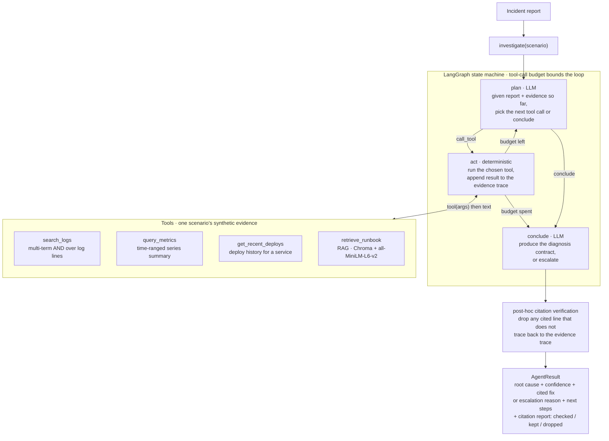
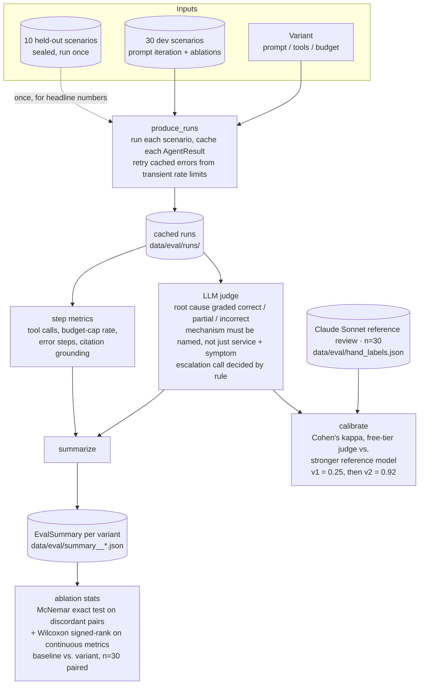

# Architecture

Two pieces: the **agent** (a plan/act/conclude loop over evidence tools) and the
**evaluation harness** around it. The harness is the point of the project — the
agent is a deliberately plain implementation of a known pattern so the evaluation
has something honest to measure.

## Agent runtime

`investigate(scenario)` compiles a LangGraph state machine and runs it to a
conclusion, then filters the citations.

- **plan** and **conclude** are the only LLM calls. Both use structured output
  (`with_structured_output`) so the loop never parses free text.
- **act** is pure Python — it looks the tool up by name and runs it. A tool error
  is appended to the trace as evidence, not raised.
- The **budget** (default 6) caps tool calls; hitting it forces `conclude`.
- **Citation verification** is deterministic (token overlap against the trace),
  runs after the LLM is done, and is logged as a metric. Delivered citations are
  100% grounded by construction; the fabrication rate is reported, not hidden.
- With a LangSmith key set, every node call is traced and tagged by scenario id,
  category, and difficulty.

## Evaluation harness

One variant = one change vs. the shipped config (a prompt version, a removed
tool, a bigger budget). Everything is cached under `data/eval/` keyed by the
variant tag, so a re-run only does the missing work — which is what makes the
pipeline survive daily free-tier quota limits.

- **The judge is calibrated before it is trusted.** A stronger model (Claude
  Sonnet) validates the harness's cheaper production judge on a 30-run
  sample, since running the stronger model as the judge for every evaluation
  run isn't $0-compatible. Its first prompt scored κ = 0.25 (too lenient — it
  accepted "right service + symptom chain" as correct). Rewritten to require
  the mechanism: κ = 0.92.
- **Ablations are paired.** Same scenarios, same seed set, baseline vs. variant,
  McNemar on the discordant pairs plus Wilcoxon on the continuous metrics. At
  n = 30 the p-values are supporting evidence; effect sizes and hand-checks of
  the borderline calls carry the argument.
- **The held-out set is run once.** It caught a variant (`conclude-v4`) that
  looked like a clean win on the dev set but cost ~15–40pp of accuracy on
  synthesis-heavy incidents. See [REPORT.md](REPORT.md).
- A separate **prompt-injection slice** injects one malicious log line into a
  base scenario and scores whether the agent follows it. See
  [SECURITY.md](SECURITY.md).
